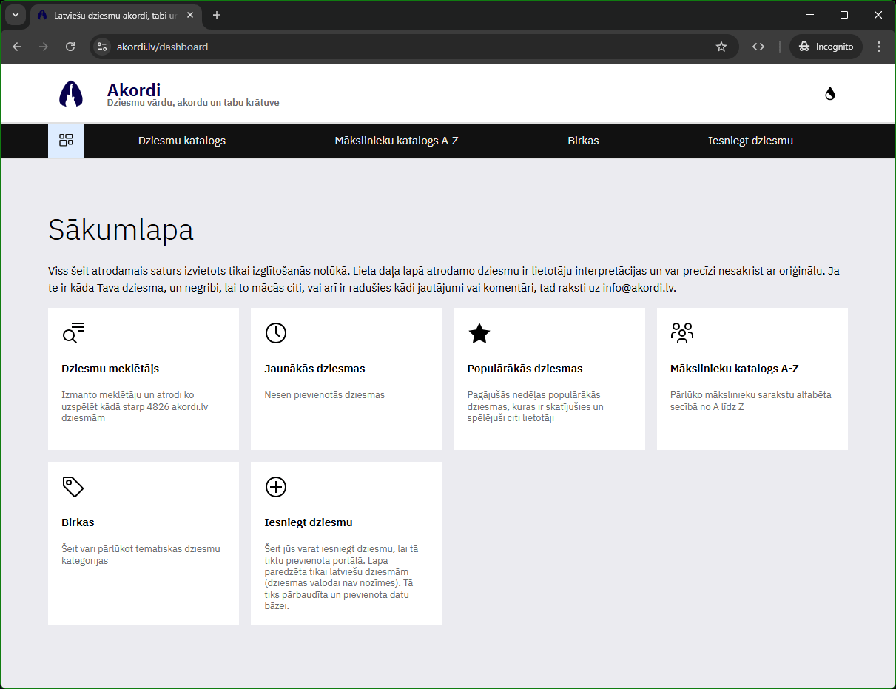
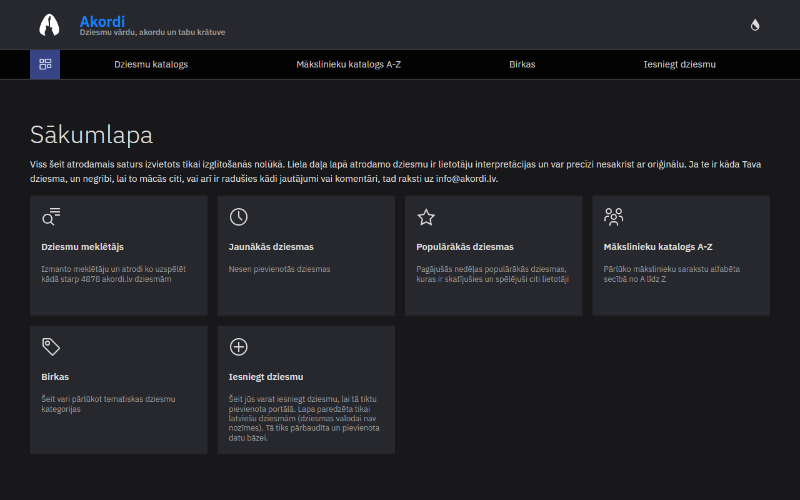

# Akordi Portal

Akordi Portal is a Vue.js application that serves as a platform for song lyrics and tabs. Visit the live site at <a href="https://www.akordi.lv" target="_blank">https://www.akordi.lv</a>.

## Features

- Browse and search for song lyrics and tabs.
- User-friendly interface with responsive design.
- Guitar and ukulele chord tabs for songs.
- Transposing chords up and down.

## Technologies Used

- **Frontend**: [LX/UI](https://github.com/wntrtech/lx-ui) components on [Vue3](https://v3.vuejs.org/), [Pinia](https://pinia.vuejs.org/), [Vue Router 4](https://next.router.vuejs.org/guide/)
- **Build Tool**: [Vite](https://vitejs.dev/)
- **Testing**: [Vitest](https://vitest.dev/)
- **Internationalization**: [Vue I18n](https://kazupon.github.io/vue-i18n/)
- **Package Manager**: [PNPM](https://pnpm.io/)
- **Linting**: [ESLint](https://eslint.org/)
- **Containerization**: [Docker](https://docker.com/)

## Screenshot

### Light Mode



### Dark Mode



## Getting Started

Follow these steps to set up the project locally:

1. Clone the repository.
2. Install dependencies:

    ```bash
    pnpm install
    ```

3. Start the development server:

    ```bash
    pnpm dev
    ```

4. Open your browser and navigate to `http://localhost:44341`.

## Contributing

Contributions are welcome! To contribute:

1. Fork the repository.
2. Create a new branch for your feature or bugfix.
3. Commit your changes and push the branch.
4. Open a pull request.

Please ensure your code adheres to the project's coding standards and includes tests where applicable.

## License

This project is licensed under the MIT License. See the [LICENSE](LICENSE) file for details.
