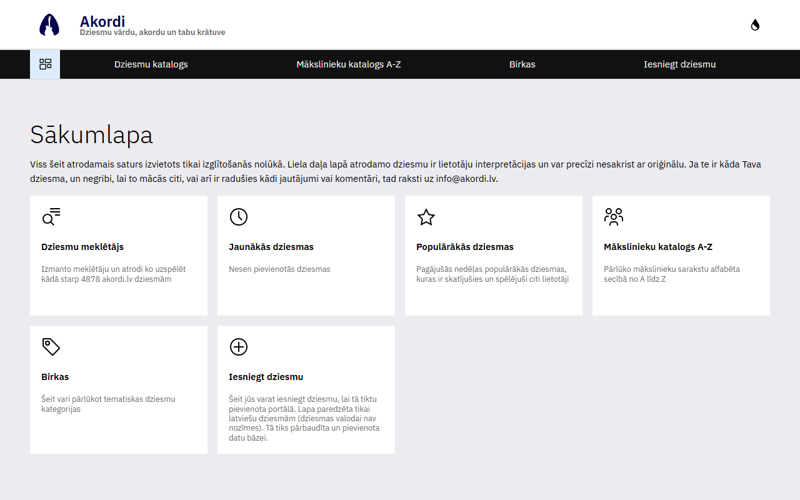

# Akordi Portal 🎵

Akordi Portal is a Vue.js application that serves as a platform for song lyrics and tabs. Visit the live site at <a href="https://www.akordi.lv" target="_blank">https://www.akordi.lv</a>.

## Screenshot 📸

### Light Mode 🌞



### Dark Mode 🌙


## Features ✨

- 🎶 Browse and search for song lyrics and tabs.
- 🖥️ User-friendly interface with responsive design.
- 🎸 Guitar and ukulele chord tabs for songs.
- ⬆️ Transposing chords up and down.
- 📜 Auto-scrolling for hands-free reading during practice.

## Technologies Used 🛠️

- **Frontend**: [LX/UI](https://github.com/wntrtech/lx-ui) components with [Vue3](https://v3.vuejs.org/), [Pinia](https://pinia.vuejs.org/), [Vite](https://vitejs.dev/)
- **Testing**: [Vitest](https://vitest.dev/)
- **Package Manager**: [PNPM](https://pnpm.io/)
- **Linting**: [ESLint](https://eslint.org/)
- **Containerization**: [Docker](https://docker.com/)

## Getting Started 🚀

Follow these steps to set up the project locally:

1. Clone the repository.
2. Install dependencies:

    ```bash
    pnpm install
    ```

3. Start the development server:

    ```bash
    pnpm dev
    ```

4. Open your browser and navigate to `http://localhost:44341`.

## Development 🧑‍💻

1. Build the development server:

    ```bash
    pnpm i
    ```

2. Run the development server (_also possible with VS Code debug functionality (F5)_):

    ```bash
    pnpm dev
    ```

3. Build for production:

    ```bash
    pnpm build
    ```

## Contributing 🤝

Contributions are welcome! To contribute:

1. Fork the repository.
2. Create a new branch for your feature or bugfix.
3. Commit your changes and push the branch.
4. Open a pull request.

Please ensure your code adheres to the project's coding standards and includes tests where applicable.

## License 📜

This project is licensed under the MIT License. See the [LICENSE](LICENSE) file for details.
